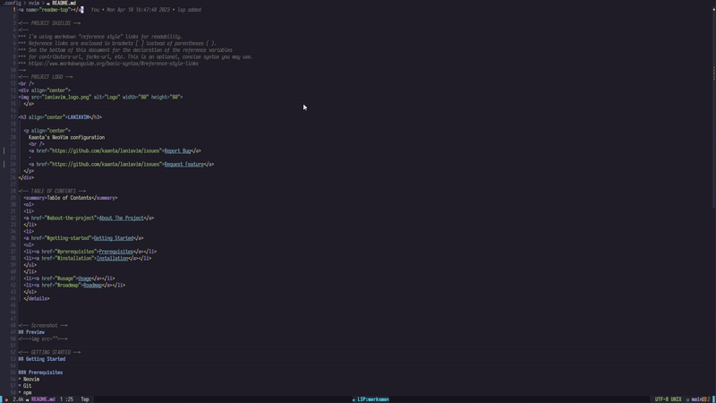

<a name="readme-top"></a>

<!-- PROJECT SHIELDS -->
<!--
*** I'm using markdown "reference style" links for readability.
*** Reference links are enclosed in brackets [ ] instead of parentheses ( ).
*** See the bottom of this document for the declaration of the reference variables
*** for contributors-url, forks-url, etc. This is an optional, concise syntax you may use.
*** https://www.markdownguide.org/basic-syntax/#reference-style-links
-->
<!-- PROJECT LOGO -->
<br />
<div align="center">

  </a>

<h3 align="center">LANIAVIM</h3>

  <p align="center">
    Kaanta's NeoVim configuration
    <br />
    <a href="https://gitlab.com/Kaanta/laniavim/issues">Report Bug</a>
    ·
    <a href="https://gitlab.com/Kaanta/laniavim/issues">Request Feature</a>
  </p>
</div>

<!-- TABLE OF CONTENTS -->
  <summary>Table of Contents</summary>
  <ol>
  <li>
  <a href="#about-the-project">About The Project</a>
  </li>
  <li>
  <a href="#getting-started">Getting Started</a>
  <ul>
  <li><a href="#prerequisites">Prerequisites</a></li>
  <li><a href="#installation">Installation</a></li>
  </ul>
  </li>
  <li><a href="#usage">Usage</a></li>
  <li><a href="#roadmap">Roadmap</a></li>
  </ol>
  </details>


<!-- Screenshot -->
## Preview 


<!-- GETTING STARTED -->
## Getting Started

### Prerequisites
* Neovim
* Git
* npm
* unzip
* unrar
* tar
### Installation
##### Backup your Current Neovim configuration :
* If *__Unix__*
   ```sh
   mv ~/.config/nvim ~/.config/nvim.back
   mv ~/.local/share/nvim ~/.local/share/nvim.back
   ```
* If *__Windows__*
   ```sh
   mv '~\AppData\Local\nvim\' '~\AppData\Local\nvim.back\'
   mv '~\AppData\Local\nvim-data\' '~\AppData\Local\nvim-data.back\'
   ```

##### Clone this repository :
```sh 
git clone https://gitlab.com/Kaanta/laniavim ~/.config/nvim --depth 1 && nvim
```
Done !

<!-- USAGE EXAMPLES -->
## Usage

nvim $FILENAME

The leader key is Space, when you want to use a keybind, press Space and then the category of the plugin you
want to use + it's first letter.

Example : SPACE(Leader) + U(UI) + N(Neotree) | Toggles Neotree and focuses it. 

<!-- ROADMAP -->
## Roadmap

- [x] Snippets 
- [x] LSP support
- [ ] Keybind displayer
- [ ] Linters
- [ ] Debuggers
<!-- CONTACT -->

## Contact

Me - [Kaanta](https://gitlab.com/Kaanta) - ikaan_oz@hotmail.com

## Uninstall

* If *__Unix__* :
    ```sh
    sudo rm -r ~/.config/nvim ~/.local/share/nvim 
    ```
* If *__Windows__* :
    ```sh 
    rm -r ~/AppData/Local/nvim ~/AppData/Local/nvim-data
    ```

<p align="right">(<a href="#readme-top">back to top</a>)</p>
